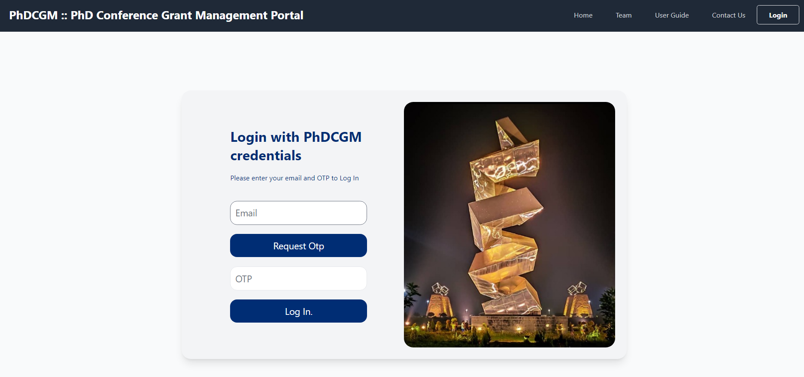
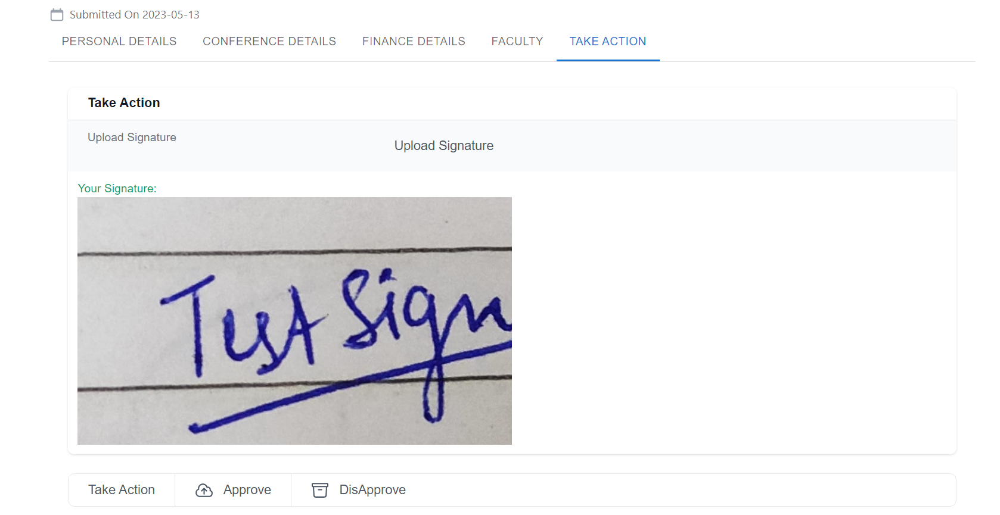

# PhD Conference Grant Management 
## DEP project by Team-12 
### Deployed At: <a href="http://172.30.2.244/"> Link </a>
### Project Web Page: <a href="https://sites.google.com/view/goyalpuneet/phd-conference-grants"> Link </a>

## Team Members
- Vinay Kumar - 2020CSB1141
- Yadwinder Singh - 2020CSB1143
- Tanuj Kumar - 2020CSB1134
- Adish Lodha - 2020CSB1063

## Mentor and Consultant
- Dr. Punnet Goyal (IIT Ropar)

## Project Description
The project stems from the need to simplify and streamline the grant application process. Currently, the offline process is time-consuming and cumbersome, making it difficult for both students and authorities to maintain and track the application data. 
With the use of our web portal, we aim to reduce the time it takes to complete the process and improve its efficiency.
The PHD Conference Grant Management Portal aims to simplify the cumbersome and time-consuming process of applying for PHD Conference grants. 
Through the portal, students can easily apply for domestic or international PHD conferences and track the status of their application. 
The portal is designed to streamline the process and provide faster approvals by routing applications to the appropriate authorities. 
The project is driven by the desire to make the application process simpler, faster, and more efficient for all stakeholders involved.

## Screenshots
- ### Login Page

- ### Student Dashboard

- ### Student Form Options

- ### Application Details For Authority 

- ### Application Approve/Disapprove

## How to run
- ### Client Side
    - First Navigate to our client directory using `cd ./client` from the root of our directory.
    - Run command `npm install` to install all the necessary dependencies.
    - Now to Start our client Side run the command `npm start`. this would start the front end of our application.

- ### Server Side
    - First Navigate to our client directory using `cd ./server` from the root of our directory.
    - Run command `npm install` to install all the necessary dependencies.
    - Now to Start our server Side run the command `npm start`. this would start the front end of our application.

## User Guide
- User can login by using the OPT sent to their institute mail id.
- Student can apply for new application for across India and over the globe.
- Student can keep track of the application status.
- Student can also fill settlement form after coming from conference.
- Supervisor, HOD and Dean PG can view details of the submitted applications and can approve by uploading sign.
- Research Section and Account Section can can view details of the submitted applications and can approve by uploading sign.
- Research Section can also upload data of students and faculty using excel file.
- Research Section can attach details of granted sanctions.
Account Section can check available balance and make payment. 

## Activity Diagram
- Login 
 

 

- Student
 

 

- Supervisor        
    

 

- HOD
 

 
- Research Section
 

 

- Account Section
 

 

- Dean PG
 
     
                                                          

## Database Schema
The database used is non relational. The view provide below show that the in the schema named phdconfgrantmang there are three collections applicationAbroad, applicationData and userSchema. In a collection a data entry  is made in the form of a document, fields of a document are shown with each collection below. Document is equivalent to a row of a SQL database and fields are equivalent to a columns.
 

 

## Deployment Diagram

## Directory Structure

## Tech Stack
- ### Frontend : ReactJS, Material UI, Tailwind CSS
- ### Backend : NodeJS, ExpressJS
- ### Database : MongoDB, Google Cloud Storage

